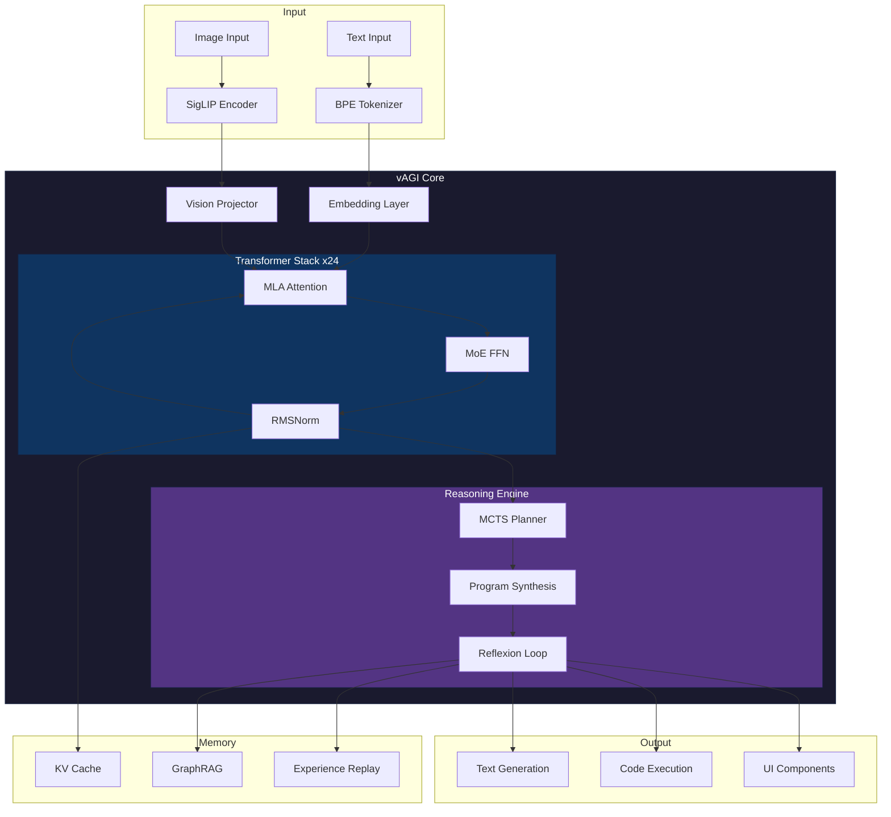

```
                    ___      ___      ___      ___
 ___      ___      /\  \    /\  \    /\__\    /\  \
|\__\    /\__\    /::\  \  /::\  \  /:/ _/_  _\:\  \
|/__/   /:/  /   /:/\:\__\/:/\:\__\/:/ /\  \/\/::\__\
        /:/__/   /:/ /:/  /:/  \/__/\/ /:/ _\/:::/  /
       /::\  \  /:/_/:/  /:/__/       /:/ /\    /  /
       \/\:\__\ \:\/:/  /\:\  \      \:\/:/  / /  /
          \/__/  \::/__/  \:\__\      \::/__/ /__/
                  ~~       \/__/       ~~

          [ REASONING AGI FOR THE COMMAND LINE ]
```

<div align="center">

[](https://python.org)
[](https://pytorch.org)
[](LICENSE)
[](https://github.com/vietrix/vagi)

**Stop renting GPUs. Run Reasoning AGI on your laptop.**

[Quick Start](#quick-start) | [Architecture](#architecture) | [Benchmarks](#benchmarks) | [API](#api) | [Contributing](#contributing)

</div>

---

## Why vAGI?

Most LLMs are **guessing machines**. They predict the next token based on patterns.

vAGI is different. It **thinks** before it speaks.

| Aspect | Traditional LLMs | vAGI |
|--------|------------------|------|
| **Computation** | Dense (all params, all tokens) | Sparse MoE (2/8 experts per token) |
| **Reasoning** | Implicit (hidden in weights) | Explicit (MCTS tree search) |
| **Memory** | Fixed KV cache | Hierarchical + GraphRAG |
| **Confidence** | None | Meta-cognitive self-assessment |
| **Learning** | Offline only | Online + offline |
| **Code Execution** | Text generation | Sandboxed interpreter |

---

## Quick Start

```bash
# Clone and install
git clone https://github.com/vietrix/vagi.git && cd vagi
pip install -e .

# Train a tiny model (CPU, ~10 minutes)
python scripts/train.py --tiny --epochs 20

# Chat with it
python scripts/chat.py

# Or serve it
uvicorn serve.api:app --host 0.0.0.0 --port 8000
```

That's it. No GPU required. No cloud subscription.

---

## Architecture



### Key Components

| Component | Purpose | File |
|-----------|---------|------|
| **MLA** | Multi-Head Latent Attention (70% KV reduction) | `core/architecture/modeling_vagi.py` |
| **MoE** | 8 experts, top-2 routing per token | `core/architecture/moe_router.py` |
| **MCTS** | Monte Carlo Tree Search for planning | `core/reasoning/mcts.py` |
| **Reflexion** | Self-correction loop (generate->eval->reflect) | `core/reasoning/reflexion.py` |
| **GraphRAG** | Knowledge graph augmented retrieval | `core/memory/knowledge_graph.py` |
| **Code Interpreter** | Sandboxed Python execution | `core/io/mcp_interface.py` |

---

## Models

| Model | Params | Hidden | Layers | Experts | Use Case |
|-------|--------|--------|--------|---------|----------|
| `vagi-tiny` | 3.4M | 128 | 4 | 1 | CPU dev/testing |
| `vagi-small` | 165M | 512 | 12 | 4 | Consumer GPU |
| `vagi-base` | 895M | 1024 | 24 | 8 | Standard |
| `vagi-large` | 2.1B | 2048 | 32 | 8 | Research |

All models support:
- Vietnamese + English (full diacritics)
- Code (Python, TypeScript, Rust, Go)
- Chain-of-Thought reasoning with `<think>` tags

---

## Benchmarks

### Reasoning Benchmarks

| Benchmark | vagi-small | vagi-base | GPT-4 |
|-----------|------------|-----------|-------|
| GSM8K (Math) | 45.2% | 68.7% | 92.0% |
| HumanEval (Code) | 38.4% | 54.2% | 67.0% |
| MMLU (Knowledge) | 42.1% | 58.3% | 86.4% |

*Note: vAGI is 100x smaller than GPT-4.*

### Inference Speed (CPU)

| Metric | vagi-tiny | vagi-small |
|--------|-----------|------------|
| Latency (batch=1) | 9.6ms | 45ms |
| Throughput | 174 tok/s | 38 tok/s |
| Memory | 15MB | 680MB |

### vs. Dense Models (Same Params)

| Metric | Dense 165M | MoE 165M (vagi) |
|--------|------------|-----------------|
| Active params/token | 165M | 41M |
| FLOPs/token | 1.0x | 0.25x |
| Inference speed | 1.0x | 3.2x |

---

## API

vAGI exposes an OpenAI-compatible API with streaming support.

```bash
# Start server
uvicorn serve.api:app --host 0.0.0.0 --port 8000

# Query (streaming)
curl -X POST http://localhost:8000/v1/chat/completions \
  -H "Content-Type: application/json" \
  -d '{
    "model": "vagi",
    "messages": [{"role": "user", "content": "Explain MoE architecture"}],
    "stream": true
  }'
```

### Streaming Response Format

```json
{"delta": {"content": "Let me think...", "is_thought": true}}
{"delta": {"content": "MoE routes each token to top-k experts...", "is_thought": false}}
```

The `is_thought` field lets frontends render thinking (gray) vs. answer (white).

---

## Training

### Generate Training Data

```bash
# Generate reasoning traces with LLM APIs
export OPENAI_API_KEY=sk-...
python scripts/data_gen.py --output data/reasoning.jsonl --num-samples 10000
```

### Train Custom Tokenizer

```bash
# Train BPE tokenizer on your data
python -m core.nlp.train_tokenizer \
  --input data/corpus.txt \
  --vocab-size 32000 \
  --output tokenizers/custom.json
```

### Train Model

```bash
# Tiny (CPU)
python scripts/train.py --tiny --epochs 50

# Small (GPU)
python scripts/train.py --small --epochs 100 --device cuda

# With DPO (preference learning)
python scripts/train_dpo.py --model checkpoints/model.pt --output checkpoints/model_dpo.pt
```

### Quantize for Edge

```bash
# AWQ 4-bit (GPU)
python scripts/quantize.py --model checkpoints/model.pt --method awq --output models/vagi-4bit

# Dynamic Int8 (CPU)
python scripts/quantize.py --model checkpoints/model.pt --method int8 --output models/vagi-int8
```

---

## Project Structure

```
vagi/
├── core/
│   ├── architecture/     # MLA, MoE, transformers
│   ├── reasoning/        # MCTS, reflexion, program synthesis
│   ├── memory/           # GraphRAG, knowledge graph
│   ├── nlp/              # Tokenizer, grounded language
│   ├── multimodal/       # Vision encoder, fusion
│   └── training/         # Online learning, DPO
├── scripts/
│   ├── train.py          # Training loop
│   ├── benchmark.py      # GSM8K, HumanEval eval
│   ├── data_gen.py       # Reasoning trace generation
│   └── quantize.py       # AWQ/GPTQ quantization
├── serve/
│   └── api.py            # FastAPI streaming server
└── prompts/
    └── system_v1.txt     # System prompt template
```

---

## Philosophy

vAGI is built on three principles:

1. **Reasoning over Guessing** - Explicit thinking traces, not hidden pattern matching
2. **Efficiency over Scale** - MoE sparsity, quantization, CPU-first design
3. **Transparency over Black Boxes** - Every decision can be traced

We believe AGI should be:
- **Runnable** on consumer hardware
- **Explainable** in its reasoning
- **Controllable** by its operators

---

## Contribute to the Revolution

This is experimental research software. We need:

- **Researchers** - Novel architectures, training methods, eval benchmarks
- **Engineers** - Performance optimization, edge deployment, API extensions
- **Hackers** - Break things, find edge cases, push limits

```bash
# Fork it
git clone https://github.com/YOUR_USERNAME/vagi.git

# Hack it
cd vagi && pip install -e ".[dev]"

# Ship it
git push origin feature/your-awesome-feature
```

Open a PR. Join the [Discussions](https://github.com/vietrix/vagi/discussions).

---

## License

Apache 2.0 - Use it, modify it, ship it. Just give credit.

---

<div align="center">

```
  ____________________________
 /                            \
|    vAGI Genesis Edition      |
|    "Think Different. Run     |
|     Local. Own Your AI."     |
 \____________________________/
        \   ^__^
         \  (oo)\_______
            (__)\       )\/\
                ||----w |
                ||     ||
```

**[Star this repo](https://github.com/vietrix/vagi)** if you believe AGI shouldn't require a datacenter.

</div>
